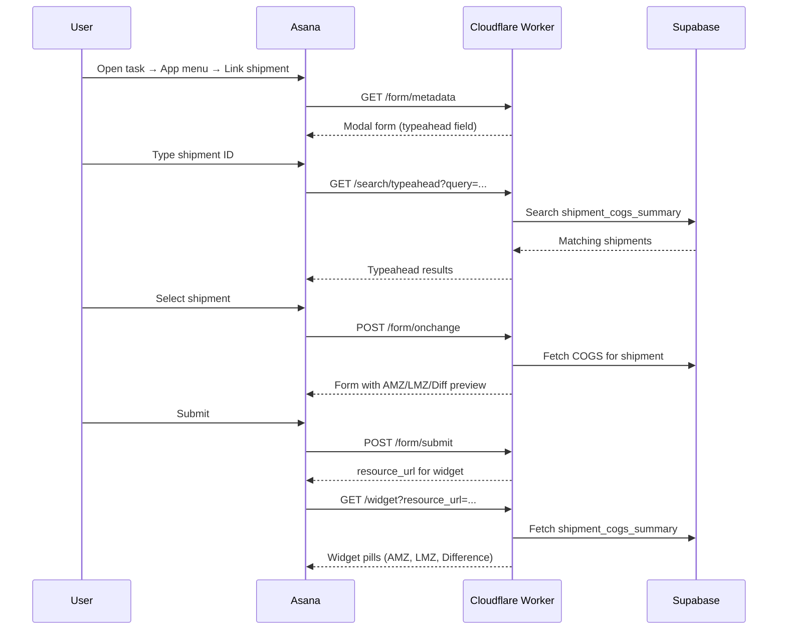

# Asana Shipment COGS Calculator

An [Asana App Component](https://developers.asana.com/docs/overview-of-app-components) that links shipments to tasks and displays calculated COGS (Amazon vs Luminize) directly on the task.

## How it works



### Data model

Shipment COGS is calculated in Supabase from:

| Source | Table | Description |
|--------|-------|-------------|
| In-house packlists | `public.packlist` | SKU/FNSKU/ASIN + qty per shipment |
| Amazon FBA queue | `fba.shipping_queue` | Amazon export with SKUs + units |
| Product mapping | `public.product_mapping` | Maps FNSKU/ASIN → canonical SKU |
| Unit costs | `public.cogs` | `amazon_proposed`, `luminize_cogs`, `latest_accepted` |

The view `public.shipment_cogs_summary` rolls up per-shipment:

- **AMZ Value** — qty × `amazon_proposed`
- **LMZ Value** — qty × `latest_accepted` (fallback: `luminize_cogs`)
- **Difference** — AMZ − LMZ

## Setup

### 1. Supabase

1. Create a Supabase project.
2. Run `schema.sql` in the SQL Editor.
3. Load your data into `packlist`, `fba.shipping_queue`, `product_mapping`, and `cogs`.
4. Verify: `SELECT * FROM shipment_cogs_summary;`

### 2. Cloudflare Worker

```bash
npm install
npx wrangler secret put SUPABASE_URL
npx wrangler secret put SUPABASE_SERVICE_ROLE_KEY
npx wrangler deploy
```

Note the deployed URL (e.g. `https://asana-app.your-subdomain.workers.dev`).

### 3. Asana App Component

In the [Asana developer console](https://app.asana.com/0/developer-console), create or edit your app and configure:

| Component | URL |
|-----------|-----|
| Form metadata | `https://YOUR-WORKER/form/metadata` |
| Widget metadata | `https://YOUR-WORKER/widget` |
| Auth (if needed) | `https://YOUR-WORKER/auth` |

Add the app to your project as a **task app component**. Users link a shipment via the modal form; the widget on the task shows live COGS.

### 4. Google Sheets (data source)

Use the google-sheets-automation skill to sync sheet exports into Supabase:

- **Packlist sheet** → `public.packlist`
- **Shipping queue export** → `fba.shipping_queue`
- **COGS sheet** → `public.cogs`
- **SKU mapping** → `public.product_mapping`

Run sync on a schedule (cron, Apps Script, or manual) so Asana always reflects current costs.

## Endpoints

| Method | Path | Purpose |
|--------|------|---------|
| GET | `/form/metadata` | Renders the link-shipment modal |
| POST | `/form/onchange` | Live COGS preview when shipment is selected |
| POST | `/form/submit` | Attaches shipment resource to the task |
| GET | `/search/typeahead` | Shipment search for the typeahead field |
| GET | `/widget` | COGS widget on the linked task |
| GET | `/auth` | OAuth placeholder for Asana app auth |

## Local development

The original Express example (`index.js`) is kept for reference. For COGS functionality, use the Cloudflare worker:

```bash
npx wrangler dev
```

Use a tunnel (e.g. `cloudflared tunnel`) or deploy to test with Asana, which requires HTTPS.

## Resources

- [Modal form](https://developers.asana.com/docs/modal-form)
- [Widget](https://developers.asana.com/docs/widget)
- [App components on tasks](https://developers.asana.com/docs/app-components-on-tasks)
